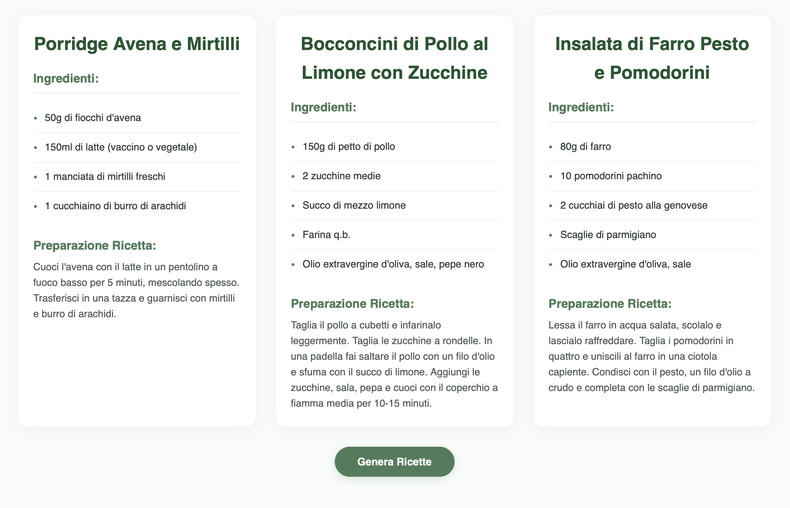

# 🥗 Recipe Randomizer



Un'applicazione web minimalista e interattiva che genera istantaneamente proposte per un pasto bilanciato. Il sistema seleziona casualmente da un database JSON una ricetta per la colazione e due opzioni distinte per pranzo e cena (con distinte fonti proteiche), garantendo un'interfaccia utente pulita e reattiva.

## ✨ Funzionalità

- **Generazione Bilanciata:** L'algoritmo filtra le ricette per "Tipo" assicurando la proposta di 1 colazione e 2 pasti per ogni estrazione.
- **Prevenzione dei Duplicati:** Implementazione di logiche di guardia (`do...while` con operatori logici) per evitare che vengano proposte due ricette con la stessa fonte proteica principale.

## 🛠️ Tecnologie Utilizzate

- **Frontend:** HTML5, CSS3 (Flexbox, animazioni `@keyframes`), Vanilla JavaScript (ES6+).
- **Data Handling:** JSON, Fetch API asincrona (`async`/`await`).

## 📂 Struttura del Progetto

```text
📦 recipe-randomizer
 ┣ 📜 index.html    # Struttura della pagina
 ┣ 📜 style.css     # Stili, layout flexbox e animazioni
 ┣ 📜 script.js     # Logica di estrazione e manipolazione del DOM
 ┣ 📜 data.json     # Database delle ricette (Array di oggetti)
 ┗ 📜 README.md     # Questo file
```

---

**Autore:** [Filippo Baldini](https://www.google.com/search?q=https://github.com/filippob04)
